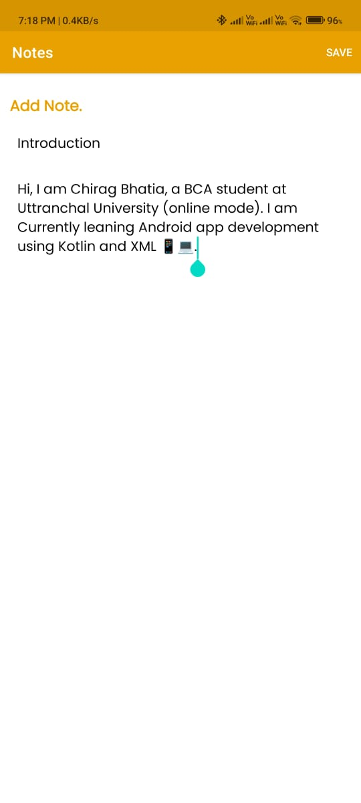

# Note App


The **Note App** is an Android application built using Kotlin that allows users to create, edit, and manage notes efficiently. This app follows the MVVM architecture pattern, providing a clean separation between the UI and logic layers. It uses Room for local database storage and Coroutines for asynchronous operations. The app is designed for users who need a simple yet powerful tool to organize their thoughts and tasks.

## Features

- **Create Notes** : Add new notes with a title and detailed content using the floating "+" button.
- **Edit and Delete Notes** : Modify existing notes or delete them via the edit screen.
- **RecyclerView**: Efficiently display a list of notes in a scrollable view.
- **Delete Option** : Available only when a note is clicked to go to the edit screen.
- **Search Functionality** : Quickly find notes using the search feature.
- **Room Database** : Efficiently stores all notes locally on the device.
- **MVVM Architecture** : Ensures clean code and separation of concerns for easy maintenance.
- **Material Design** : Provides a user-friendly interface with a modern design.
- **Coroutines** : Used for handling asynchronous operations.

## Technologies Used

- **Kotlin** : The main programming language for Android development.
- **Room** : For local storage of notes in a SQLite database.
- **MVVM Architecture** : Ensures separation between business logic and UI components.
- **ViewModel** : Used for managing UI-related data in a lifecycle-conscious way.
- **LiveData** : Ensures the UI updates automatically when the data changes.
- **XML** : Used for designing the app's user interface.
- **Material Design** : Provides a modern and intuitive UI/UX experience.
- **Coroutines** : For managing background tasks and asynchronous operations.

## Screenshots

<p align="center">
  
  
  
  
</p>

## Installation

To run the Note app on your device or emulator, follow these steps:

1. **Clone the repository:**

    ```bash
    git clone https://github.com/bhatiachirag2002/Note_App_using_kotlin.git
    ```

2. **Open the project in Android Studio:**

    - Launch Android Studio.
    - Select `Open an existing Android Studio project`.
    - Navigate to the cloned repository and select the project folder.

3. **Build the project:**

    - Ensure you have the correct Android SDK installed.
    - Build the project by clicking on the "Build" menu and selecting "Build Project".

4. **Run the app:**

    - Connect an Android device or use an emulator.
    - Click on the "Run" button to install and run the app.

## Usage

1. **Add New Note** : Tap the floating "+" button to create a new note.
2. **Edit Note** : Tap on any existing note to edit its content.
3. **Delete Note** : On the edit screen, use the delete option to remove the note.
4. **Search Notes** : Use the search bar at the top to quickly find specific notes.

## Contributing

Contributions are welcome! If you have any suggestions, feature requests, or bug reports, feel free to create a pull request or open an issue.

## License

This project is licensed under the MIT License. See the [LICENSE](LICENSE) file for more details.
